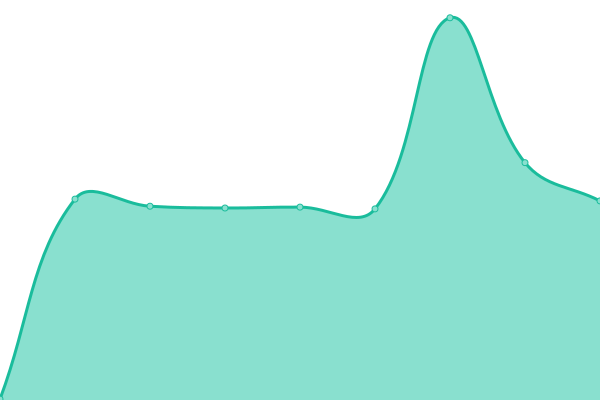
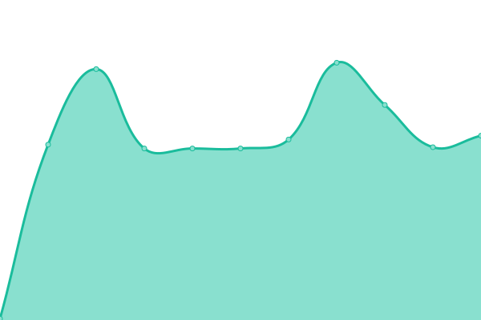

# [📈 Live Status](https://upptime.github.io/upptime): <!--live status--> **🟩 All systems operational**

This repository contains the open-source uptime monitor and status page for [Upptime](https://upptime.js.org), powered by [Upptime](https://github.com/upptime/upptime).

With [Upptime](https://upptime.js.org), you can get your own unlimited and free uptime monitor and status page, powered entirely by a GitHub repository. We use [Issues](https://github.com/upptime/upptime/issues) as incident reports, [Actions](https://github.com/duandaxei/upptime/actions) as uptime monitors, and [Pages](https://upptime.github.io/upptime) for the status page.

<!--start: status pages-->
<!-- This summary is generated by Upptime (https://github.com/upptime/upptime) -->
<!-- Do not edit this manually, your changes will be overwritten -->
<!-- prettier-ignore -->
| URL | Status | History | Response Time | Uptime |
| --- | ------ | ------- | ------------- | ------ |
|  [RustDesk Public Rendezvous Server](rs-ny.rustdesk.com) | 🟩 Up | [rust-desk-public-rendezvous-server.yml](https://github.com/duandaxei/upptime/commits/HEAD/history/rust-desk-public-rendezvous-server.yml) | 

 135ms
     
 | 

<a href="https://duandaxei.github.io/upptime/history/rust-desk-public-rendezvous-server">100.00%</a>
    

|  RustDesk Public Relay Server - 0 | 🟩 Up | [rust-desk-public-relay-server-0.yml](https://github.com/duandaxei/upptime/commits/HEAD/history/rust-desk-public-relay-server-0.yml) | 

 248ms
     
 | 

<a href="https://duandaxei.github.io/upptime/history/rust-desk-public-relay-server-0">100.00%</a>
    

|  RustDesk Public Relay Server - 1 | 🟩 Up | [rust-desk-public-relay-server-1.yml](https://github.com/duandaxei/upptime/commits/HEAD/history/rust-desk-public-relay-server-1.yml) | 

 153ms
     
 | 

<a href="https://duandaxei.github.io/upptime/history/rust-desk-public-relay-server-1">98.72%</a>
    

|  RustDesk Public Relay Server - 2 | 🟩 Up | [rust-desk-public-relay-server-2.yml](https://github.com/duandaxei/upptime/commits/HEAD/history/rust-desk-public-relay-server-2.yml) | 

 163ms
     
 | 

<a href="https://duandaxei.github.io/upptime/history/rust-desk-public-relay-server-2">100.00%</a>
    

|  RustDesk Public Relay Server - 3 | 🟩 Up | [rust-desk-public-relay-server-3.yml](https://github.com/duandaxei/upptime/commits/HEAD/history/rust-desk-public-relay-server-3.yml) | 

 169ms
     
 | 

<a href="https://duandaxei.github.io/upptime/history/rust-desk-public-relay-server-3">100.00%</a>
    

<!--end: status pages-->

[**Visit our status website →**](https://upptime.github.io/upptime)

## 📄 License

- Powered by: [Upptime](https://github.com/upptime/upptime)
- Code: [MIT](./LICENSE) © [Anand Chowdhary](https://anandchowdhary.com), supported by [Pabio](https://pabio.com)
- Data in the `./history` directory: [Open Database License](https://opendatacommons.org/licenses/odbl/1-0/)
